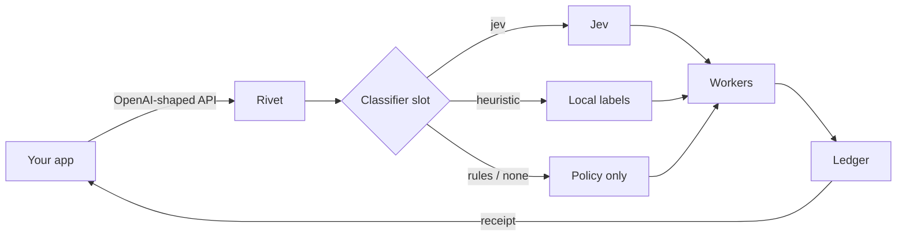

# Rivet

**One API. Your providers. Zero toll.**

You already pay OpenAI. You already have a GPU in the closet. Rivet is the missing switchboard: one OpenAI-shaped door that talks to them, picks a route, and hands you a receipt.

No marketplace tax. Their tokens stay on their bill. Rivet’s cut on those calls is **$0**.

```
your app  →  Rivet token orchestrator
                 ├─ classifier slot   none | rules | heuristic | jev
                 ├─ ledger   tokens, $, model, cluster — reopen later
                 └─ workers   OpenAI-compatible + local + demo
```

The workers write. A classifier *may* decide. The ledger always remembers.




This repository is a **part** of a larger agentic operating system — the token plane. Command, Control, and Kanister bolt on through the same API. See [docs/AGENTIC_OS.md](docs/AGENTIC_OS.md).

## Quick start

```bash
git clone https://github.com/hdiesel323/rivet.git
cd rivet
./scripts/start.sh
# console  http://localhost:5173
# API      http://127.0.0.1:8000
```

Prerequisites: Python 3.10+, [uv](https://docs.astral.sh/uv/), Node 18+.

No API keys required. The demo worker stays on this machine. To hit a live model:

```bash
cp app/server/.env.sample app/server/.env
# set OPENAI_API_KEY=...   or LOCAL_BASE_URL=http://127.0.0.1:8000/v1
```

```bash
curl -s http://127.0.0.1:8000/v1/chat/completions \
  -H 'content-type: application/json' \
  -d '{"model":"auto","messages":[{"role":"user","content":"Hello from Rivet"}]}'
```

Read `rivet.model_used`, `rivet.why`, `usage`, `vendor_usd`, `rivet_usd = 0`.

Print the leave-behind: http://localhost:5173/print.html

## What this MVP does

| Surface | What it proves |
|---|---|
| `POST /v1/chat/completions` | OpenAI shape your SDK already speaks (`usage`, `created`, `finish_reason`) |
| Classifier slot | `none`, `rules`, `classifier:heuristic`, `jev` (needs `JEV_URL`) |
| Policy | Cheap-first cascade, pin-local, pin-frontier, residency, max $ / call |
| Ledger | SQLite reopen + CSV export |
| Cache | Exact-match hit → `vendor_usd = 0` |
| Console | Connectors, slot, playground, receipt, fixture compare |
| Fixture | 50 labeled prompts; compare does **not** invent quality scores |

OAuth grants are the destination. This cut uses env keys and a local base URL.

## Product rule (non-negotiable)

> Connectors and orchestration: **$0**.
> Work on *their* connected account: **$0 from Rivet**.
> Work Rivet hosts later (optional models, agents that run while you’re away): billed.

If the slot is Jev (or another paid classifier), that meter shows on the same receipt. Still not a Rivet markup on the worker.

## Drop-in

```
OPENAI_BASE_URL=http://127.0.0.1:8000/v1
```

Your code never changes `base_url` again. You change policy — and you can prove the new policy’s spend.

## Project structure

```
app/client          Vite + TypeScript console
app/server          FastAPI orchestrator, SQLite ledger
specs/              feature contract
scripts/start.sh    backend + frontend
docs/               orchestrator, OS bolt-in, one-pager
```

### Manual start

```bash
cd app/server && uv sync --all-extras && uv run python server.py
cd app/client && npm install && npm run dev
cd app/server && uv run pytest -q
```

## Docs

- [docs/ORCHESTRATOR.md](docs/ORCHESTRATOR.md) — slot, ledger, splits
- [docs/AGENTIC_OS.md](docs/AGENTIC_OS.md) — how this part bolts into Command/Control
- [docs/ROADMAP.md](docs/ROADMAP.md) — OAuth, streaming, scored promote
- [specs/001-token-orchestrator.md](specs/001-token-orchestrator.md) — acceptance contract

MIT. Fork it. Point `base_url` at it.
