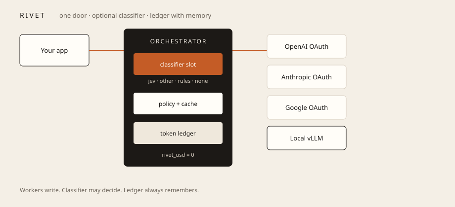
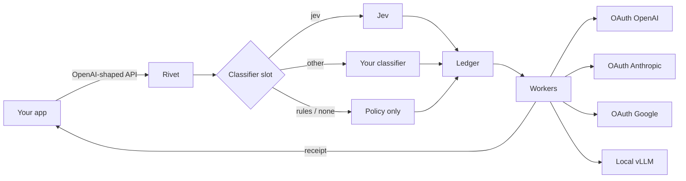
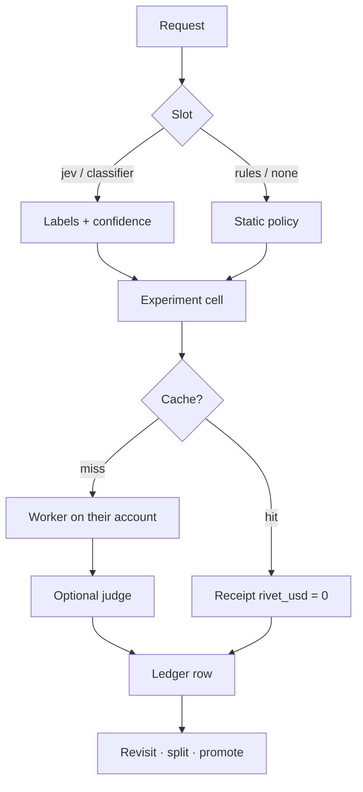

# Rivet

**One API. Your providers. Zero toll.**

You already pay OpenAI. You already pay Anthropic. You already have a GPU in the closet. Rivet is the missing switchboard: one OpenAI-shaped door that talks to all of them, picks a route, and hands you a receipt.

No marketplace tax. No “we’ll just add 5%.” Their tokens stay on their bill. Rivet’s cut on those calls is **$0**.

```
your app  →  Rivet token orchestrator
                 ├─ classifier slot   jev | other | rules | none
                 ├─ ledger   tokens, $, model, cluster — reopen later
                 └─ workers   your OAuth providers + local
```

The workers write. A classifier *may* decide. The ledger always remembers.







## The token orchestrator

Rivet is the house for three jobs that usually rot in three different dashboards:

1. **Classify (optional)** — slot: Jev, another connected classifier, rules only, or none. Same label schema when anything learned is on.
2. **Meter** — every call becomes a row you can reopen: tokens in/out, `vendor_usd`, `rivet_usd`, model, classifier labels, latency, cache hit.
3. **Compare** — similar work can run control vs challenger vs holdout — including **Jev vs no-Jev** vs rules. Scores come back. The winning *route and classifier* get promoted.

That loop is the product: *route → spend → score → route better.* Not a one-shot proxy.

See [docs/ORCHESTRATOR.md](docs/ORCHESTRATOR.md). What to build next: [docs/RECOMMENDATIONS.md](docs/RECOMMENDATIONS.md).

## Why this is interesting

Most “unified LLM APIs” are merchants. They rent you someone else’s models and skim the invoice.

Rivet is the opposite product:

- **You bring the models** via OAuth (or a local adapter).
- **Rivet brings the control plane** — optional classifier, policy routes, the ledger keeps the film.
- **The receipt is the feature.** Every response says which worker ran, why, what the vendor charged, the experiment cell, and that Rivet charged nothing.

That is the difference between a proxy and a product people can trust in a finance review.

## Thirty-second demo

No build. No keys. No Docker.

```bash
git clone https://github.com/hdiesel323/rivet.git
cd rivet/app && python3 -m http.server 8765
# open http://localhost:8765
```

1. Hit **Connect** on Local vLLM + one cloud provider.
2. Leave policy on **Cheap-first**.
3. Send the default prompt.
4. Read the receipt: `model_used`, `why`, `vendor_usd`, `rivet_usd = 0.00`.

Print the leave-behind: open `app/print.html` → Print → Save as PDF.

## What you get in the MVP

| Surface | What it proves |
|---|---|
| Connector cards | BYO providers, not a rented catalog |
| Policy | Cheap-first cascade, pin-local, pin-frontier, residency, max $ / call |
| Playground | Real `/v1/chat/completions` shape your SDK already speaks |
| Receipt + trace | The pitch in one screenshot |
| Classifier slot + ledger (spec) | Jev, other, rules, or none — [ORCHESTRATOR.md](docs/ORCHESTRATOR.md) |

Routing here is deterministic on purpose so the story is visible without burning tokens. The next step is the same UI on live OAuth grants.

## Product rule (non-negotiable)

> Connectors and orchestration: **$0**.  
> Work on *their* connected account: **$0 from Rivet**.  
> Work Rivet hosts later (optional models, agents that run while you’re away): billed.

If the slot is Jev (or another paid classifier), that meter shows on the same receipt. Still not a Rivet markup on the worker.

If a competitor needs a cut of your Anthropic invoice to exist, they are a marketplace. Rivet is a switchboard with a memory.

## The shape teams actually ship

```
POST /v1/chat/completions   model: "auto"
        |
        ├─ classifier slot (jev | other | rules | none)
        ├─ semantic cache
        ├─ cheap local / small cloud
        ├─ verify → escalate to frontier
        ├─ provider B if provider A 429s
        └─ ledger row (tokens, $, cluster, score when it exists)
```

Your code never changes `base_url` again. You change policy — and you can prove the new policy won.

## Who this is for

- A team with two provider bills and no idea which model answered last week
- Anyone running vLLM / Ollama who still needs a frontier escape hatch
- Platform people who have to show FinOps a line item that isn’t “we marked up tokens”
- Builders who want one SDK and many backends without selling their traffic to a reseller
- Anyone who wants a token ledger — with Jev, without Jev, or while they A/B the two

## Repo

```
app/index.html           live console
app/print.html           one-pager for print / PDF
docs/ONEPAGER.md         same story in markdown
docs/ORCHESTRATOR.md     classifier slot + ledger + split tests
docs/diagrams/architecture.svg
docs/RECOMMENDATIONS.md  what to ship next
```

MIT. Fork it. Point `base_url` at it when the live gateway lands.

## Status

Proof you can hold. Not a production gateway yet — don’t paste live keys into the demo.

If this is the control plane you wanted sitting in front of *your* OAuth connectors, star the repo and open an issue for the first real provider you want wired.
